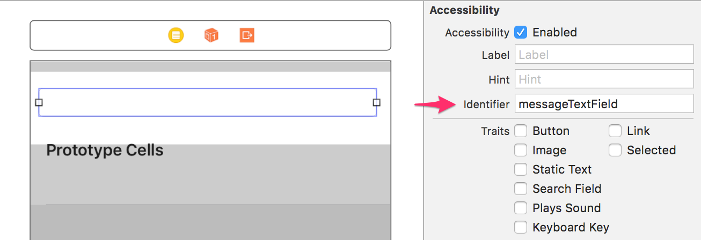
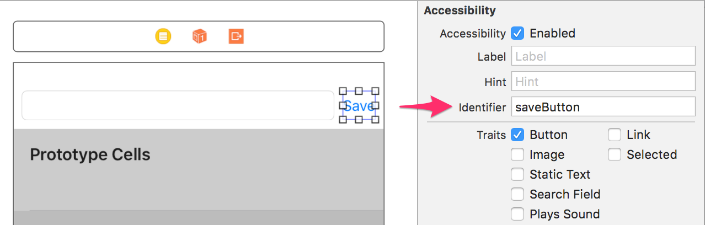

### Specify adding a message [<span class="octicon octicon-mark-github"></span>](https://github.com/learn-tdd-in/cocoa-touch/commit/ae3a81786cd3f4e2393aed0f5cc28ca3da4af5c3)

#### LearnTDDInCocoaTouchTests/E2E/CreatingAMessageTest.swift

```diff
+import XCTest
+import EarlGrey
+
+class CreatingAMessageTest: XCTestCase {
+    
+    func testCreatingAMessage() {
+        EarlGrey.select(elementWithMatcher: grey_accessibilityID("messageTextField"))
+            .perform(grey_typeText("New message"))
+        EarlGrey.select(elementWithMatcher: grey_accessibilityID("saveButton"))
+            .perform(grey_tap())
+        
+        EarlGrey.select(elementWithMatcher: grey_accessibilityID("messageTextField"))
+            .assert(with: grey_text(""))
+        EarlGrey.select(elementWithMatcher: grey_accessibilityLabel("New message"))
+            .assert(with: grey_sufficientlyVisible())
+    }
+    
+}
```

To start out, we write an acceptance test for the entire feature we want to build. This test specifies that the user will enter a message into a field, tap an Add button, and then see that message in the first cell of a table.

The first error we get is that there is no message field:

Red: NoMatchingElementException. ...accessibilityID('messageTextField')


### Add new message field [<span class="octicon octicon-mark-github"></span>](https://github.com/learn-tdd-in/cocoa-touch/commit/415591ad2008349573369b8d10f60ce51284e786)

#### LearnTDDInCocoaTouch/MessagesViewController.swift

```diff
+import UIKit
+
+class MessagesViewController: UITableViewController {
+
+}
```

As part of adding the message field, we go ahead and set up the table view controller we’ll be using. We set the accessibility identifier on the field to "messageTextField" so the acceptance test can find it.



The next error we get is similar: now we can’t find the Save button:

Red: NoMatchingElementException. accessibilityID('saveButton')


### Add save button [<span class="octicon octicon-mark-github"></span>](https://github.com/learn-tdd-in/cocoa-touch/commit/352589db3a3e2e6ce5dd6a1dc5bd2c0cf0dcc7bc)


We put a Save button into the view and give it an accessibility identifier of "saveButton" so the test can find it.



Next, the test sees that the new message field isn't correctly cleared out when the Save button is tapped:

Red: AssertionFailedException. Element Matcher: accessibilityID('messageTextField'), Assertion Criteria: hasText('')


### Clear text field upon save [<span class="octicon octicon-mark-github"></span>](https://github.com/learn-tdd-in/cocoa-touch/commit/860ef427f4fef1f27301a75ad6a962b41e286e37)

#### LearnTDDInCocoaTouch/MessagesViewController.swift

```diff
 import UIKit
 
 class MessagesViewController: UITableViewController {
-
+    @IBOutlet var messageTextField: UITextField!
+    
+    @IBAction func save() {
+        messageTextField.text = ""
+    }
 }
```

We hook up an action to the save button to clear out the text field when it's tapped.

Now our feature test makes it all the way to the final assertion. The test is looking for the new message to appear somewhere on screen, but it doesn't:

Red: NoMatchingElementException. accessibilityLabel('New message')


### Drive table view out of messages store [<span class="octicon octicon-mark-github"></span>](https://github.com/learn-tdd-in/cocoa-touch/commit/d3112a532cd4c19e7e9b9930c6130ee2b31f7d2b)

#### LearnTDDInCocoaTouch/MessagesViewController.swift

```diff
 import UIKit
 
 class MessagesViewController: UITableViewController {
+    private var store: MessageStore!
+    
     @IBOutlet var messageTextField: UITextField!
     
     @IBAction func save() {
+        guard let text = messageTextField.text else { return }
+        store.create(text)
         messageTextField.text = ""
+        tableView.reloadData()
+    }
+    
+    override func viewDidLoad() {
+        super.viewDidLoad()
+        
+        store = MessageStore()
+    }
+
+    override func numberOfSections(in tableView: UITableView) -> Int {
+        return 1
+    }
+
+    override func tableView(_ tableView: UITableView, numberOfRowsInSection section: Int) -> Int {
+        return store.count
+    }
+
+    override func tableView(_ tableView: UITableView, cellForRowAt indexPath: IndexPath) -> UITableViewCell {
+        let cell = tableView.dequeueReusableCell(withIdentifier: "cell", for: indexPath)
+
+        let message = store.get(indexPath.row)
+        cell.textLabel?.text = message
+
+        return cell
     }
 }
```

Rather than storing the messages in a simple array in the view controller, let's separate out responsibilities by creating a MessageStore class. First, let's write the code we wish we had in the view controller. We create a MessageStore, use it to provide the count and message for each table cell. When Save is tapped, we create a new message.

Because we haven't implemented this MessageStore, we get compiler errors. Let's take them one at a time:

Red: Use of undeclared type 'MessageStore'


### Add message store [<span class="octicon octicon-mark-github"></span>](https://github.com/learn-tdd-in/cocoa-touch/commit/07ff21d5beb70cb470171405b81639311b9b274d)

#### LearnTDDInCocoaTouch/MessageStore.swift

```diff
+import Foundation
+
+class MessageStore {
+
+}
```

Let's only write enough code to fix that compiler error. First, we create a MessageStore type.

Red: Value of type 'MessageStore' has no member 'count'


### Add count property [<span class="octicon octicon-mark-github"></span>](https://github.com/learn-tdd-in/cocoa-touch/commit/d724e0711385ce4070f444f012d92b65b79d9516)

#### LearnTDDInCocoaTouch/MessageStore.swift

```diff
 
 class MessageStore {
 
+    var count = 0
+    
 }
```

Right now we just want to add the minimal code to get the app to compile. We don't want to add any behavior to the class yet; we'll wait until we have a unit test for it to do that. The simplest way to get a count property to compile is to just add a simple stored property. An initial value of zero seems reasonable.

Red: Value of type 'MessageStore' has no member 'create'


### Add create method [<span class="octicon octicon-mark-github"></span>](https://github.com/learn-tdd-in/cocoa-touch/commit/7314ddfbe0c4b15e7a074e01261885d20b0a2bae)

#### LearnTDDInCocoaTouch/MessageStore.swift

```diff
 
     var count = 0
     
+    func create(_ message: String) {
+        
+    }
+    
 }
```

The create method has no return value, so it's easy to get it to compile: we just add a method with the correct signature and no body.

Red: Value of type 'MessageStore' has no member 'get'


### Add get method to store [<span class="octicon octicon-mark-github"></span>](https://github.com/learn-tdd-in/cocoa-touch/commit/709ebc3818c2418533ad31a60aed8cb2694197fe)

#### LearnTDDInCocoaTouch/MessageStore.swift

```diff
         
     }
     
+    func get(_ index: Int) -> String {
+        return "fake message"
+    }
+    
 }
```

We add a get() method. We just need it to return a String to compile. Rather than returning an empty string, we return an obviously-fake string. That way we can more easily tell what's going on if we get that string returned later when we don't expect it.

Now the MessageStore compiles, but our feature test is still failing with the same error: the message isn't appearing on screen. We need to actually get the MessageStore to _do_ something.

Red: NoMatchingElementException. accessibilityLabel('New message')


### Specify count should increase [<span class="octicon octicon-mark-github"></span>](https://github.com/learn-tdd-in/cocoa-touch/commit/5ed6c50fe11fa81c9d33e308804618f514798a27)

#### LearnTDDInCocoaTouchTests/Unit/MessageStoreTests.swift

```diff
+import XCTest
+@testable import LearnTDDInCocoaTouch
+
+class MessageStoreTests: XCTestCase {
+    
+    var store: MessageStore!
+    
+    override func setUp() {
+        super.setUp()
+        store = MessageStore()
+    }
+    
+    func testCountShouldIncreaseWhenMessageCreated() {
+        store.create("Some message")
+        
+        let count = store.count
+        
+        XCTAssertEqual(count, 1, "Expected store.count to be 1 but was \(count)")
+    }
+    
+}
```

The first problem we have is that the table view is never showing any rows. To get it to show a row, we need the count to increase when a message is added. We write a unit test for MessageStore to confirm this behavior. We add a custom error message to make our test failure easier to understand.

Inner Red: Expected store.count to be 1 but was 0


### Increase count upon create [<span class="octicon octicon-mark-github"></span>](https://github.com/learn-tdd-in/cocoa-touch/commit/f7ad0c77b7b6adccf613afadd323ca059010f8ab)

#### LearnTDDInCocoaTouch/MessageStore.swift

```diff
     var count = 0
     
     func create(_ message: String) {
-        
+        count += 1
     }
     
     func get(_ index: Int) -> String {
```

The unit test passes; the count is increased. We rerun our feature test and confirm that the message still isn't showing in that cell, though.

Outer Red:


### Specify returning the same message added [<span class="octicon octicon-mark-github"></span>](https://github.com/learn-tdd-in/cocoa-touch/commit/ca826cbc534120b0dafde4892e195a2ebd429ee6)

#### LearnTDDInCocoaTouchTests/Unit/MessageStoreTests.swift

```diff
         XCTAssertEqual(count, 1, "Expected store.count to be 1 but was \(count)")
     }
     
+    func testGetShouldReturnMessageAdded() {
+        let createdText = "test message text"
+        
+        store.create(createdText)
+        
+        let retrievedText = store.get(0)
+        XCTAssertEqual(retrievedText, createdText)
+    }
+    
 }
```

We add another unit test to confirm that the get() method returns the same message added via create().

Inner Red: ("fake message") is not equal to ("test message text")

Our unit test error confirms that we're currently returning a hard-coded message.


### Return the same message added [<span class="octicon octicon-mark-github"></span>](https://github.com/learn-tdd-in/cocoa-touch/commit/fb849866b7ac39629331929f1c3e0d0e912f85db)

#### LearnTDDInCocoaTouch/MessageStore.swift

```diff
 
 class MessageStore {
 
-    var count = 0
+    var messages: [String] = []
+    
+    var count: Int {
+        return messages.count
+    }
     
     func create(_ message: String) {
-        count += 1
+        messages.append(message)
     }
     
     func get(_ index: Int) -> String {
-        return "fake message"
+        return messages[index]
     }
     
 }
```

We implement the behavior the unit test specifies: when create() is called we store the message in an array, and when get() is called we return the message at the appropriate index.

Inner Green

Outer Green

With that, both our unit test and feature test are passing. We've finished test-driving our feature! To make sure it works, run your app and see.

